# Архитектура ERP: текущее состояние

> Актуальна на 2026-04-01. Код — source of truth.

---

## 1. Обзор системы

Modular monolith на Rust. Один binary (`gateway`), crate per Bounded Context, PostgreSQL с RLS для tenant isolation.

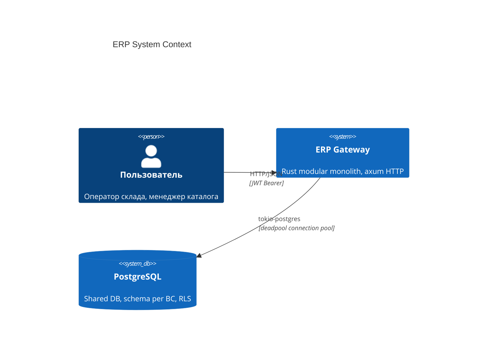

---

## 2. Граф зависимостей crate'ов

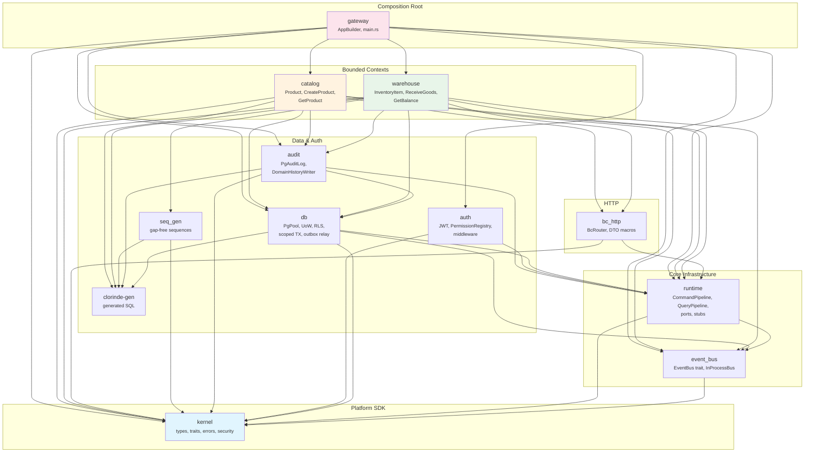

---

## 3. Луковая архитектура внутри BC

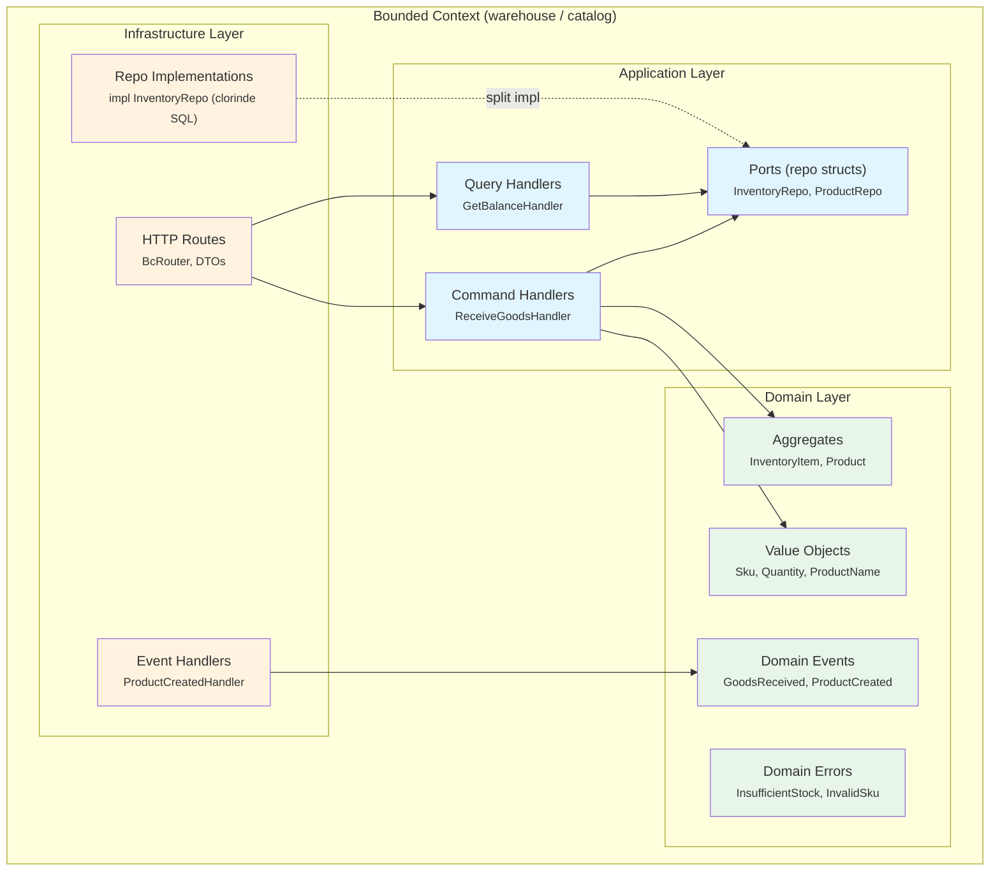

**Split impl pattern:** struct `InventoryRepo` определён в `application/ports.rs`, методы реализованы в `infrastructure/repos.rs`. Handler импортирует из своего слоя.

---

## 4. Canonical Write Path (Command Pipeline)

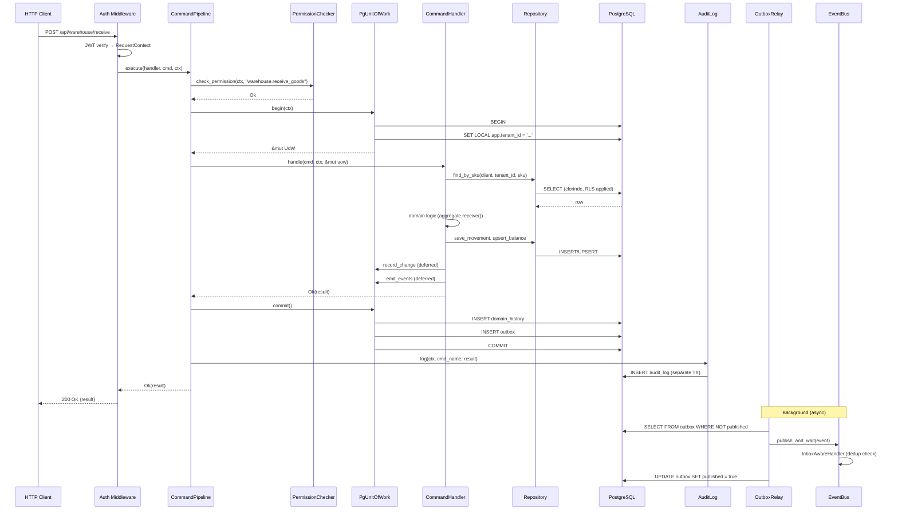

---

## 5. Read Path (Query Pipeline)

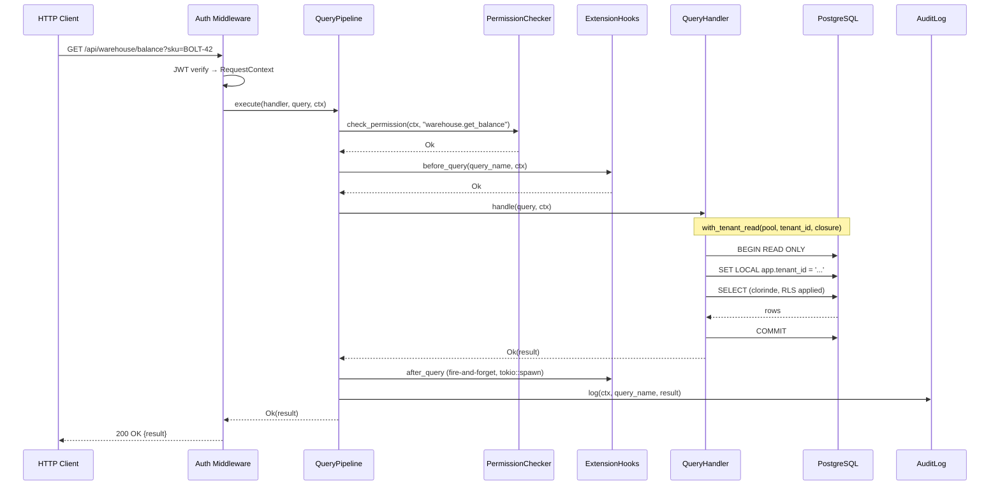

---

## 6. Cross-BC Event Flow

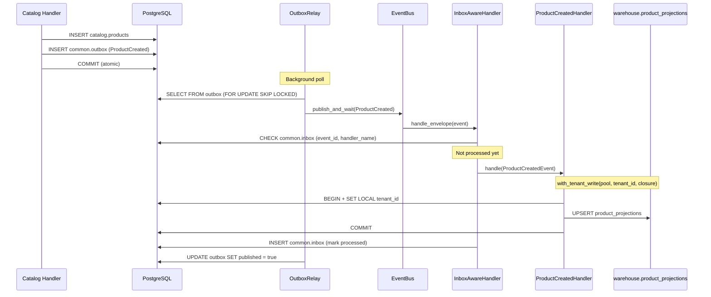

---

## 7. Tenant Isolation (RLS)

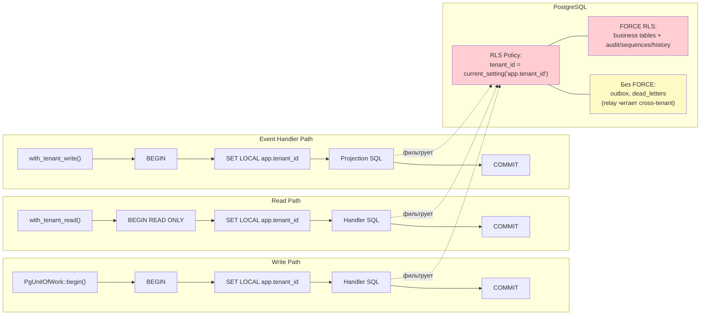

---

## 8. RBAC: BC-Owned Permissions

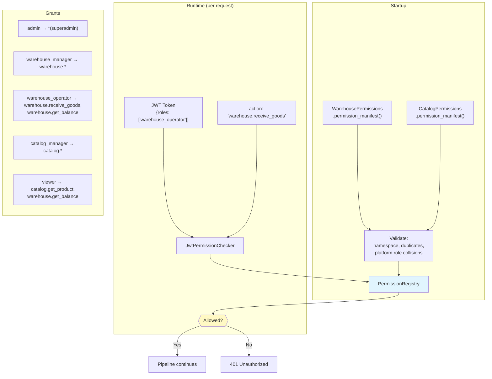

---

## 9. Database Schema

Схема получена из реальной БД через MCP (`erp-dev-pg`).

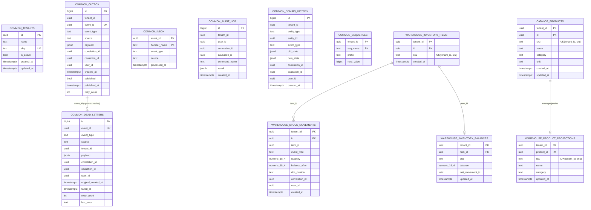

Все UNIQUE-ограничения на `sku` — tenant-scoped: `UNIQUE(tenant_id, sku)`, не глобальные.

---

## 10. Gateway Assembly

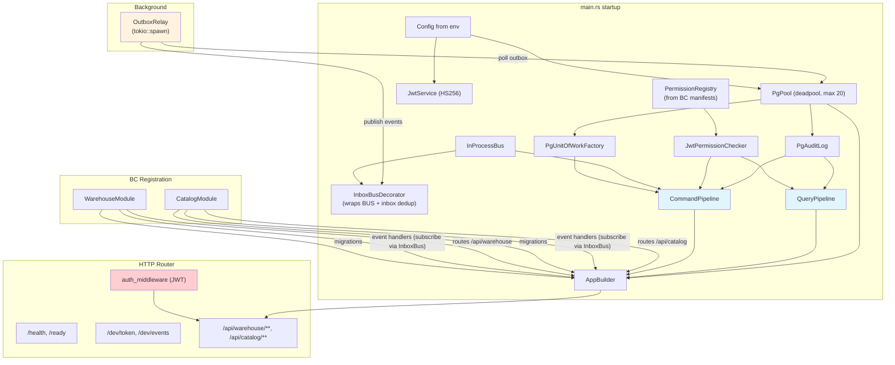

---

## 11. Outbox Relay + Inbox Dedup

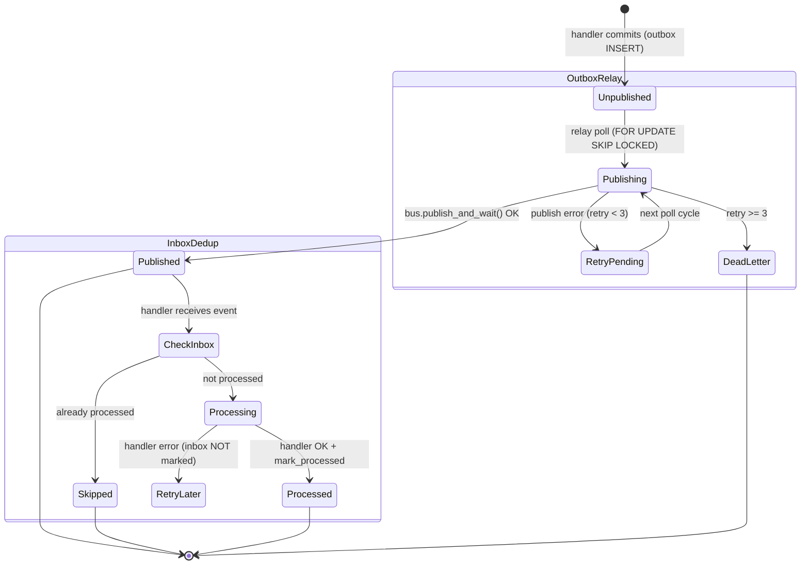

---

## 12. Структура файлов BC (шаблон)

```
crates/{bc_name}/
├── src/
│   ├── lib.rs                          # pub mod application, domain, infrastructure
│   ├── module.rs                       # impl BoundedContextModule
│   ├── registrar.rs                    # impl PermissionRegistrar
│   ├── domain/
│   │   ├── mod.rs
│   │   ├── aggregates.rs              # Rich aggregates + AggregateRoot impl
│   │   ├── events.rs                  # DomainEvent impl (erp.{bc}.{event}.v{N})
│   │   ├── value_objects.rs           # Sku, Quantity, etc. (validation)
│   │   └── errors.rs                  # BC-specific DomainError
│   ├── application/
│   │   ├── mod.rs
│   │   ├── ports.rs                   # Repo struct + DTO (split impl pattern)
│   │   ├── commands/
│   │   │   └── {command}.rs           # Command + CommandHandler
│   │   └── queries/
│   │       └── {query}.rs             # Query + QueryHandler
│   └── infrastructure/
│       ├── mod.rs
│       ├── repos.rs                   # impl ports::Repo (clorinde SQL)
│       ├── event_handlers.rs          # Integration event subscribers
│       ├── http.rs                    # BcRouter + DTO macros
│       └── routes.rs                  # axum Router builder
├── tests/
│   └── integration.rs                 # E2E tests with real PostgreSQL
├── Cargo.toml
└── BC_CONTEXT.md                      # BC passport (aggregates, events, tables)
```

---

## 13. Ключевые архитектурные решения

| Решение | Обоснование |
|---------|-------------|
| Modular monolith | Один binary, split to microservices позже через EventBus trait |
| PostgreSQL shared DB + schema per BC | Одна БД, изоляция через RLS + schema namespace |
| Clorinde (SQL-first) | SQL в файлах, codegen без БД при компиляции |
| Transactional outbox | Атомарность: бизнес-данные + events в одной TX |
| Inbox dedup | At-least-once delivery + per-handler dedup; handler'ы должны быть идемпотентны (UPSERT) |
| FORCE RLS | Owner подчиняется RLS на business + audit таблицах; outbox/dead_letters без FORCE (relay читает cross-tenant) |
| Closure-based TX (`with_tenant_read/write`) | Невозможно забыть BEGIN/COMMIT |
| Split impl для repos | Onion architecture без trait overhead |
| BC-owned RBAC | Каждый BC декларирует свои роли/permissions |
| UUID v7 | Time-ordered для лучшей производительности B-tree индексов |
| BigDecimal в BC | Точная арифметика для денег/количеств |
