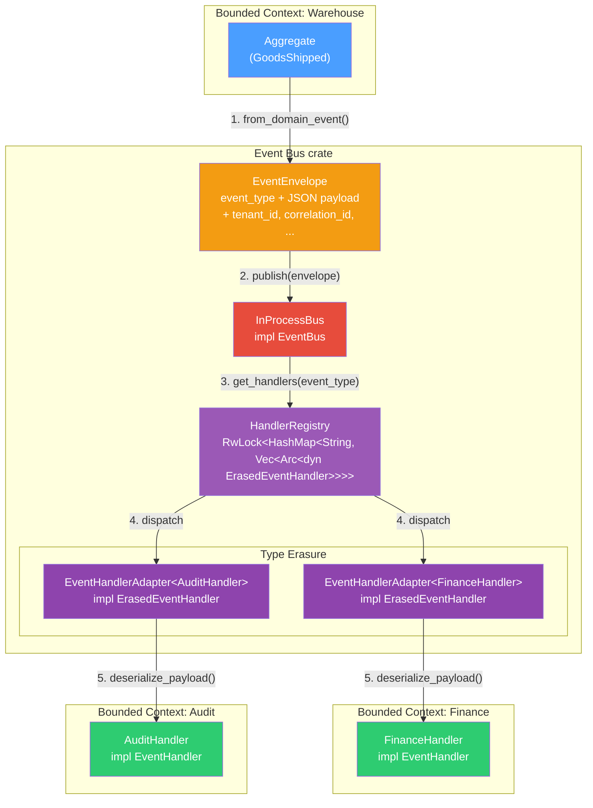
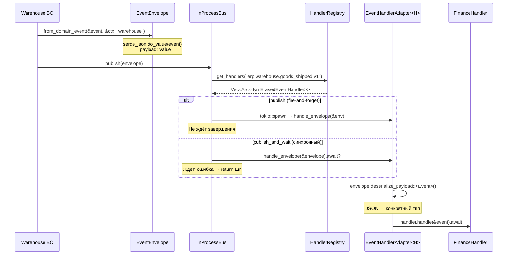
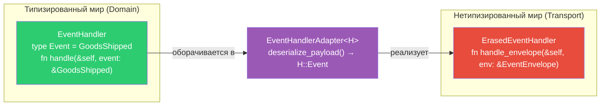
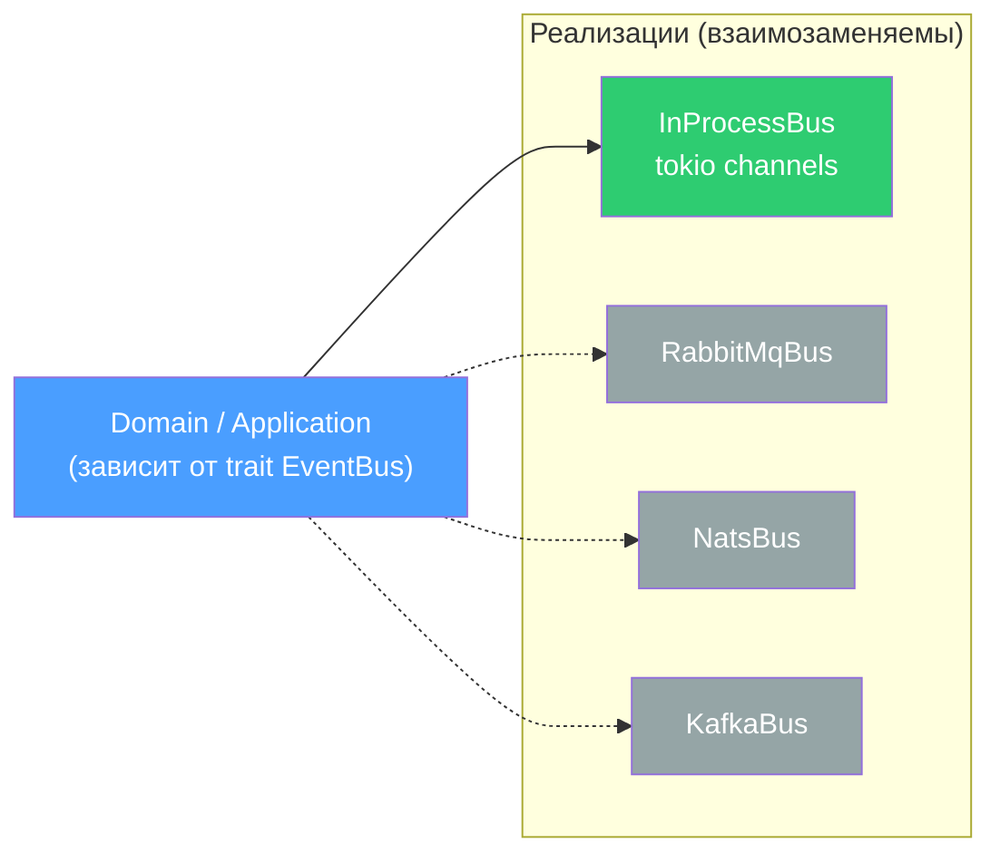

# Event Bus — архитектура шины событий

## Идея

Bounded Contexts (модули ERP) не вызывают друг друга напрямую. Вместо этого один модуль **публикует событие**, а другие **подписываются** на него. Это развязывает модули: Warehouse ничего не знает о Finance, но Finance реагирует на отгрузки.

---

## Схема архитектуры



## Схема потока данных



## Схема type erasure



---

## Слои (4 уровня абстракции)

| Слой | Файл | Что делает |
|------|------|------------|
| `DomainEvent` | `kernel/src/events.rs` | Trait — что произошло (определяется в каждом BC) |
| `EventEnvelope` | `event_bus/src/envelope.rs` | Транспортная обёртка: JSON payload + метаданные |
| `EventBus` trait | `event_bus/src/traits.rs` | Контракт publish/subscribe (заменяемый) |
| `InProcessBus` | `event_bus/src/bus.rs` | Реализация: tokio, in-memory |

---

## 1. Доменное событие

Каждый BC определяет свои события, реализуя трейт `DomainEvent` из kernel:

```rust
#[derive(Debug, Clone, Serialize, Deserialize)]
struct GoodsShipped {
    id: Uuid,
    sku: String,
    quantity: i32,
}

impl DomainEvent for GoodsShipped {
    fn event_type(&self) -> &'static str { "erp.warehouse.goods_shipped.v1" }
    fn aggregate_id(&self) -> Uuid { self.id }
}
```

## 2. Конверт — type erasure

Bus не может работать с дженериками (нельзя хранить `Vec<разных типов>`).
Событие **сериализуется в JSON** и оборачивается в `EventEnvelope`:

```rust
// envelope.rs:50-66
let envelope = EventEnvelope::from_domain_event(&event, &ctx, "warehouse")?;
// Внутри: payload = serde_json::to_value(event) → serde_json::Value
```

Конверт несёт метаданные: `event_type`, `tenant_id`, `correlation_id`, `timestamp` —
всё что нужно для routing и трассировки.

## 3. Подписчик — EventHandler → ErasedEventHandler

Подписчик реализует типизированный `EventHandler`:

```rust
// traits.rs:22-37
#[async_trait]
pub trait EventHandler: Send + Sync + 'static {
    type Event: DomainEvent;                                    // конкретный тип
    async fn handle(&self, event: &Self::Event) -> Result<()>;  // типизированный вызов
    fn handled_event_type(&self) -> &'static str;               // routing key
}
```

Bus хранит обработчики в `HashMap<String, Vec<Arc<dyn ???>>>` — ему нужен
**один trait без дженериков**. Это `ErasedEventHandler`:

```rust
// registry.rs:23-31
#[async_trait]
pub trait ErasedEventHandler: Send + Sync + 'static {
    async fn handle_envelope(&self, envelope: &EventEnvelope) -> Result<()>;
    fn event_type(&self) -> &'static str;
}
```

Мост между ними — `EventHandlerAdapter<H>`:

```rust
// registry.rs:48-62
impl<H: EventHandler> ErasedEventHandler for EventHandlerAdapter<H>
where H::Event: DeserializeOwned
{
    async fn handle_envelope(&self, envelope: &EventEnvelope) -> Result<()> {
        let event: H::Event = envelope.deserialize_payload()?;  // JSON → тип
        self.handler.handle(&event).await                        // типизированный вызов
    }
}
```

## 4. Реестр и dispatch

`HandlerRegistry` хранит обработчиков, сгруппированных по типу события:

```
"erp.warehouse.goods_shipped.v1"  →  [FinanceHandler, AuditHandler]
"erp.finance.invoice_created.v1"  →  [NotificationHandler]
```

При публикации Bus ищет обработчиков по строке `event_type` и вызывает каждого.

## 5. Два режима публикации

```rust
// bus.rs — InProcessBus

// Fire-and-forget: handler'ы в отдельных tokio tasks, ошибки логируются
async fn publish(&self, envelope: EventEnvelope) {
    for handler in handlers {
        let env = envelope.clone();
        tokio::spawn(async move {           // ← не ждём
            handler.handle_envelope(&env).await;
        });
    }
}

// Синхронный: ждём каждого, первая ошибка → return Err
async fn publish_and_wait(&self, envelope: EventEnvelope) {
    for handler in handlers {
        handler.handle_envelope(&envelope).await?;  // ← ждём
    }
}
```

- `publish` — для side effects после коммита TX (отправить email, обновить кэш)
- `publish_and_wait` — для domain events внутри транзакции (consistency)

## 6. Заменяемость

`EventBus` — trait. Сейчас `InProcessBus` (память, tokio).
При переходе к микросервисам — `RabbitMqBus` / `NatsBus` / `KafkaBus`,
тот же trait, domain-код не меняется:


